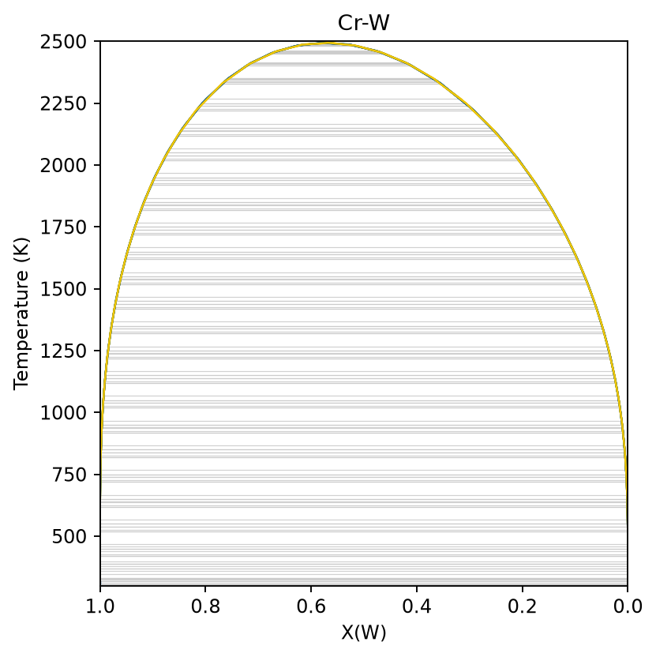
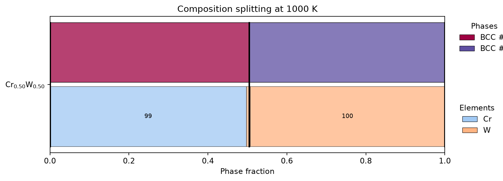
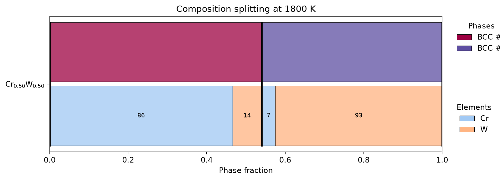

# Phase diagrams and composition splitting

`run_phase_diagram_prediction` supports binary T-x diagrams and isothermal
ternary diagrams. This binary example is the one shown below:

```python
import raptor_alloys as rap

diagram = rap.run_phase_diagram_prediction(
    alloy_system=["Cr", "W"],
    tdb_dir=rap.TDB_DIR,
    temperature_min=300,
    temperature_max=2500,
    temperature_step=100,
    composition_step=0.05,
)
```

## Representative phase-diagram output



The horizontal coordinate is W mole fraction and the vertical coordinate is
temperature. The yellow boundary encloses the BCC_A2 miscibility gap predicted
by this database. Use a finer grid for quantitative boundary work.

For a ternary diagram, supply three elements and the isothermal `temperature`.

Use composition splitting when the nominal alloy is already known and the goal
is to inspect equilibrium phase compositions at up to three temperatures:

```python
splitting = rap.run_composition_splitting_prediction(
    alloy_system=["Cr", "W"],
    mols=[[0.5, 0.5]],
    temperatures=[1000, 1800],
    tdb_dir=rap.TDB_DIR,
)

for point in splitting.results:
    print(point.temperature, point.data)
```

## Representative composition-splitting output



At 1000 K, equimolar Cr-W splits into two BCC_A2 composition sets: one is
approximately 98.6 at.% Cr and the other approximately 99.5 at.% W.



At 1800 K, the two equilibrium compositions move closer together, consistent
with approaching the top of the miscibility gap. Download the exact example
rows from [composition-splitting.csv](../assets/outputs/composition-splitting.csv).

Including intermetallics can materially change equilibrium results. Record the
`include_intermetallics` setting with exported diagrams.
