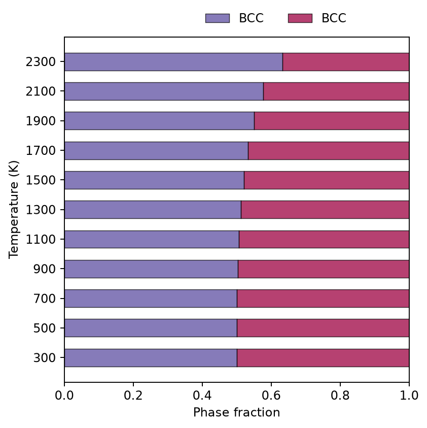
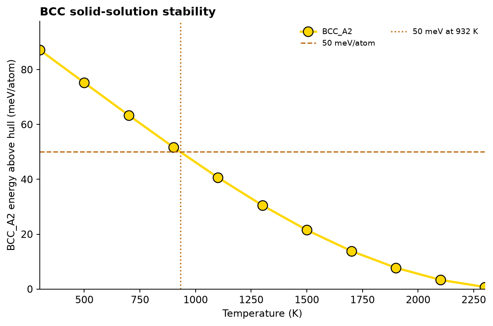

# Phase stability versus temperature

Use `run_phase_fraction_temperature_prediction` for one nominal composition.

```python
import raptor_alloys as rap

result = rap.run_phase_fraction_temperature_prediction(
    alloy_system=["Cr", "W"],
    mol_ratio=[0.5, 0.5],
    temperature_min=300,
    temperature_max=2500,
    temperature_step=200,
    tdb_dir=rap.TDB_DIR,
)

print(result.metastable_temperature)
print(result.stable_temperature)
print(result.data.head())
```

## Representative output



The two colors are two equilibrium composition sets of BCC_A2—not two
different crystal structures. Their fractions add to one. As temperature
increases, their fractions and compositions approach one another.



For this coarse grid, RAPTor estimates the 50 meV/atom metastability crossing
at approximately **932 K**. It does not find the zero-energy stability crossing
within the requested range, so `stable_temperature` is `None`.

The underlying example tables are available as
[phase-stability.csv](../assets/outputs/phase-stability.csv) and
[phase-stability-energy.csv](../assets/outputs/phase-stability-energy.csv).

The homogeneous BCC_A2 energy above the equilibrium hull is reported in
meV/atom. Zero indicates equilibrium stability; RAPTor's current operational
metastability threshold is 50 meV/atom.

Always report the composition, grid, TDB, phase selection, and threshold when
publishing a detected transition temperature.
