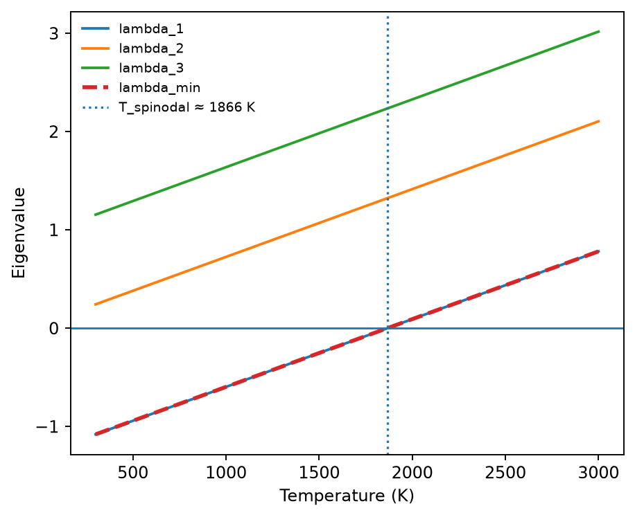
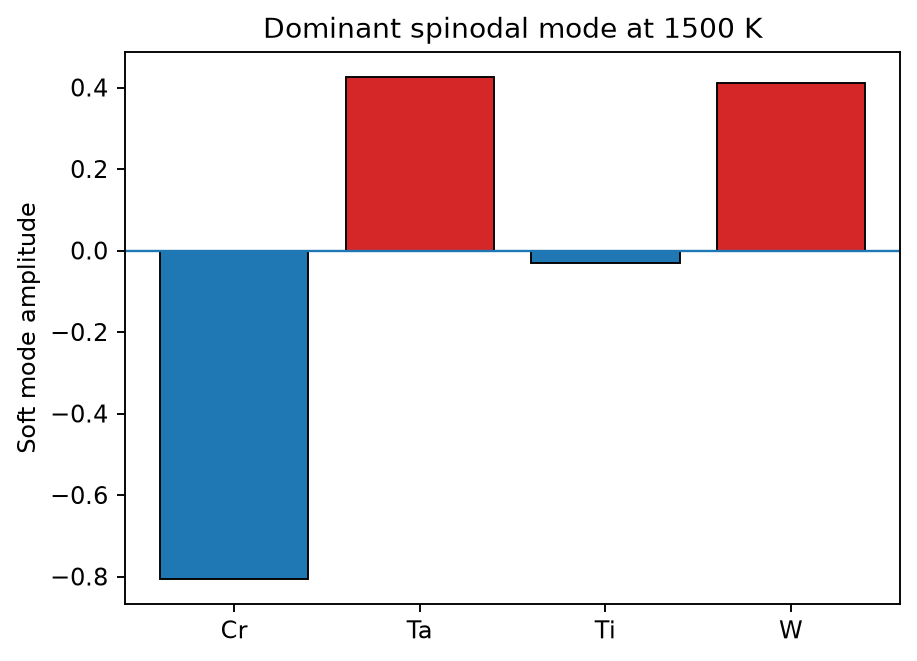

# Spinodal analysis

Spinodal analysis evaluates the constrained-composition Hessian across a
temperature grid and reports its eigenvalue spectrum. A negative minimum
eigenvalue indicates a locally unstable homogeneous solution in the model.

```python
from pathlib import Path
import raptor_alloys as rap

interactions = (
    rap.TDB_DIR.parent / "spinodal" / "binary_interactions.json"
)

result = rap.run_spinodal_analysis(
    alloy_system=["Cr", "Ta", "Ti", "W"],
    mol_ratio=[0.25] * 4,
    lattice="BCC",
    temperature_min=300,
    temperature_max=3000,
    temperature_step=100,
    mode_temperature=1500,
    interaction_data_path=interactions,
)
```

## Representative output



The red dashed curve is the minimum eigenvalue. Its zero crossing gives an
estimated spinodal temperature of approximately **1866 K** for this equimolar
Cr-Ta-Ti-W BCC model.



The mode separates Ta and W from Cr and Ti. Reversing every sign gives the same
physical fluctuation. The numerical spectrum is available as
[spinodal-spectrum.csv](../assets/outputs/spinodal-spectrum.csv).

`spinodal_temperature` is an estimated zero crossing on the sampled grid and
may be `None`. The soft eigenvector is sign-indeterminate: multiplying every
component by −1 describes the same physical mode.
