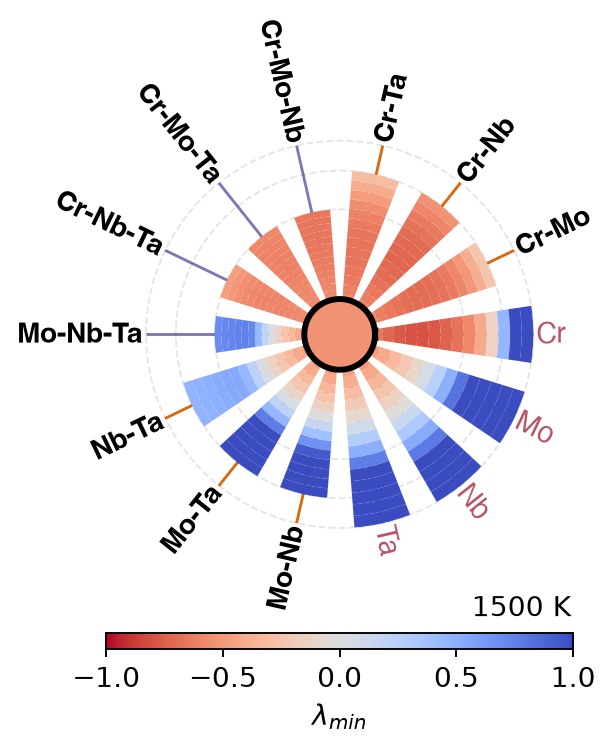

# SymPlex maps

SymPlex projects properties over quaternary and quinary composition spaces.

```python
import raptor_alloys as rap

result = rap.run_symplex_prediction(
    alloy_system=["Cr", "Mo", "Nb", "Ta"],
    temperature=1500,
    constraint_element="Cr",
    property_name="Minimum Spinodal Eigenvalue",
)
```

## Representative output



Each radial strip represents a ternary face or constrained section of the
quaternary composition space. Red values have negative minimum eigenvalues and
are locally spinodally unstable in the model; blue values are locally stable.
The central disk represents the equimolar quaternary composition.

Supported user-facing properties currently include:

- `SPSS Phase Fraction`
- `BCC Energy Above Hull`
- `Number of Phases`
- `Minimum Spinodal Eigenvalue`

The calculation uses RAPTor's packaged database directory. High-dimensional
grids can be expensive; save the generated data as well as the figure.
